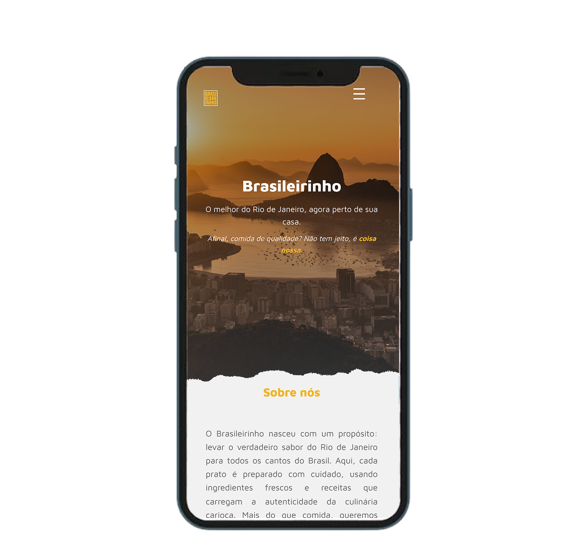

# Brasileirinho

**Brasileirinho** é um projeto de site para um restaurante de comidas típicas brasileiras, com foco na culinária do Rio de Janeiro. O site é desenvolvido utilizando HTML e CSS, proporcionando uma experiência visual agradável, responsiva e acessível para os usuários em diferentes dispositivos.

## Slogan

> Brasileirinho  
> O melhor do Rio de Janeiro, agora perto de sua casa.  
> Afinal, comida de qualidade? Não tem jeito, é coisa nossa.

## Descrição do Projeto

O site apresenta o cardápio, informações sobre o restaurante, localização e contato, tudo com um design que remete à cultura e ao sabor da comida brasileira. O objetivo é transmitir a autenticidade e a qualidade da culinária carioca, aproximando o cliente da experiência de saborear pratos típicos sem sair de casa. As ferramentas utilizadas no projeto foram ensinadas através do Bootcamp Desenvolvimento Web Responsivo, da Unisagrado.

## Responsividade

O layout do site é totalmente responsivo, adaptando-se perfeitamente a diferentes tamanhos de tela, desde desktops até dispositivos móveis, garantindo uma navegação confortável e intuitiva em smartphones e tablets. 


## Protótipo

A prototipagem do design foi realizada no **Figma**, permitindo uma visualização clara da estrutura e do fluxo do site antes da implementação.

## Tecnologias Utilizadas

- HTML5  
- CSS3  
- Figma (para prototipagem)

## Estrutura do Projeto

- `index.html` — página principal do site  
- `styles.css` — arquivo de estilos CSS para o layout e design  
- `script.js` — arquivo de estilos JS para interações com o usuário  
- `prints/` — pasta contendo imagens de visualização em dispositivos móveis

## Como Usar

1. Clone este repositório:  
```bash
git clone https://github.com/LuizDavilaa/Brasileirinhos.git


2. Abra o arquivo `index.html` no seu navegador preferido.

## Conclusão
A realização do projeto permitiu ao grupo aplicar, na prática, os conceitos aprendidos em sala de aula sobre desenvolvimento web básico (HTML e CSS) e prototipagem. Além do aprendizado técnico, também desenvolvemos habilidades de trabalho em equipe, divisão de tarefas e organização.

Como melhorias futuras, seria possível ampliar o cardápio, implementar funcionalidades de pedido online e tornar a página mais interativa.
